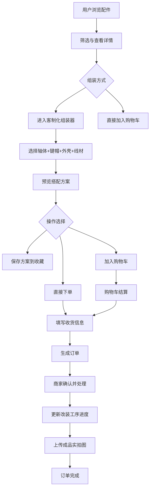

## 1. 产品概述

赛博浅青数码外设定制改装全栈平台——面向机械键盘爱好者与客制化玩家的在线定制改装平台。商家可上架键盘轴体、键帽、外壳、线材等配件，用户可自由搭配组装客制化套件、提交改装定制需求、生成专属搭配订单；后台管理配件库存、记录改装工序进度、留存成品实拍图，并提供月度销量图表、库存自动扣减与补货提醒、权限分级管理。

- 目标用户：机械键盘爱好者、客制化玩家、外设改装商家
- 核心价值：一站式数码外设定制改装，从选配到下单到生产追踪的完整闭环

## 2. 核心功能

### 2.1 用户角色

| 角色 | 注册方式 | 核心权限 |
|------|----------|----------|
| 普通用户 | 邮箱/用户名注册 | 浏览配件、组装搭配、下单、收藏方案、查看订单 |
| 商家 | 注册后申请商家认证 | 上架配件、管理库存、处理订单、上传成品图 |
| 管理员 | 系统分配 | 全部权限、用户管理、数据统计、权限分配 |

### 2.2 功能模块

1. **首页**: Hero区、热门搭配推荐、新品配件、快捷入口
2. **配件商城**: 配件分类浏览、参数筛选、详情查看
3. **客制化组装器**: 可视化搭配键盘套件（选轴体+键帽+外壳+线材）
4. **购物车**: 配件/套件加入购物车、数量调整、批量操作
5. **订单中心**: 下单、状态流转追踪、改装进度查看
6. **收藏夹**: 改装方案收藏、方案对比
7. **个人中心**: 用户信息、订单历史、收藏管理
8. **商家后台**: 配件上架/编辑、库存管理、订单处理、成品图上传
9. **管理后台**: 用户管理、权限分配、月度销量图表、库存补货提醒

### 2.3 页面详情

| 页面名称 | 模块名称 | 功能描述 |
|----------|----------|----------|
| 首页 | Hero区 | 赛博浅青科技风大图轮播、键盘线材线条装饰动画 |
| 首页 | 热门搭配 | 展示收藏数最高的客制化方案卡片 |
| 首页 | 新品上架 | 最新配件横向滚动展示 |
| 配件商城 | 分类导航 | 轴体/键帽/外壳/线材四大分类Tab |
| 配件商城 | 筛选面板 | 品牌轴体类型/材质/配色/价格区间等多维筛选 |
| 配件商城 | 商品列表 | 卡片式展示、支持排序与分页 |
| 配件详情 | 基础信息 | 图片、名称、价格、库存、参数表 |
| 配件详情 | 搭配推荐 | 推荐与此配件常搭配的其他配件 |
| 客制化组装器 | 选择面板 | 分步选择轴体→键帽→外壳→线材 |
| 客制化组装器 | 预览区 | 实时预览搭配效果与总价 |
| 客制化组装器 | 操作栏 | 保存方案、加入购物车、直接下单 |
| 购物车 | 商品列表 | 购物车商品列表、数量增减、删除 |
| 购物车 | 结算栏 | 合计金额、去结算按钮 |
| 订单中心 | 订单列表 | 订单卡片（编号、状态、金额、时间） |
| 订单中心 | 订单详情 | 状态时间线、改装进度、成品实拍图 |
| 收藏夹 | 方案列表 | 收藏的改装方案卡片，支持取消收藏 |
| 个人中心 | 信息管理 | 修改昵称、头像、密码 |
| 个人中心 | 订单历史 | 历史订单列表 |
| 商家后台 | 配件管理 | 上架/编辑/下架配件、上传图片 |
| 商家后台 | 库存管理 | 库存查看、补货提醒、手动补货 |
| 商家后台 | 订单处理 | 确认订单、更新工序进度、上传成品图 |
| 管理后台 | 用户管理 | 用户列表、角色分配、封禁 |
| 管理后台 | 数据统计 | 月度改装订单销量图表（ECharts） |
| 管理后台 | 库存监控 | 全局库存概览、低库存预警列表 |

## 3. 核心流程

**用户客制化下单流程**：用户浏览配件→选择分类→筛选参数→进入组装器→逐步选择轴体/键帽/外壳/线材→预览搭配→保存方案/加入购物车/直接下单→填写收货信息→支付确认→生成订单→商家确认→工序进度更新→完成→上传成品实拍图。

**商家配件管理流程**：商家登录→进入后台→上架配件（填写参数+上传图）→设置库存→订单来了→确认→更新进度→上传成品图→完成。

**库存自动扣减流程**：用户下单→系统自动扣减对应配件库存→库存低于阈值→触发补货提醒→商家补货。

## 4. 用户界面设计

### 4.1 设计风格

- **主色调**：深空灰(#1A1D23)、电光浅青(#7DFDFE)、哑光白(#F0F2F5)
- **辅助色**：暗青灰(#2A2F38)、浅青透明(#7DFDFE20)、高亮青(#B8FFFE)
- **按钮风格**：圆角6px、浅青描边按钮(主要)、深灰填充按钮(次要)、hover时浅青发光效果
- **字体**：标题使用 Rajdhani（科技感），正文使用 Noto Sans SC
- **布局风格**：顶部导航栏、左侧边栏（后台）、卡片式内容、网格布局
- **装饰元素**：键盘轴体轮廓线条、客制化线材曲线装饰、电路板纹理背景、浅青色发光粒子
- **动画**：页面加载时浅青色光线扫过、卡片悬浮时浅青发光边框、数字跳动动画

### 4.2 页面设计概览

| 页面名称 | 模块名称 | UI元素 |
|----------|----------|--------|
| 首页 | Hero区 | 全屏深空灰背景、浅青色键盘线条SVG装饰、渐变文字、光线扫过动画 |
| 首页 | 热门搭配 | 卡片网格、浅青描边卡片、悬浮发光效果 |
| 配件商城 | 筛选面板 | 左侧固定面板、多选标签、价格滑块 |
| 配件商城 | 商品列表 | 三列卡片、图片+参数标签、库存状态指示灯 |
| 客制化组装器 | 选择面板 | 四步进度条、分步Tab切换、配件缩略图选择 |
| 客制化组装器 | 预览区 | 中央预览卡片、浅青色线材装饰框、动态总价 |
| 购物车 | 商品列表 | 表格布局、数量步进器、浅青小计高亮 |
| 订单中心 | 状态时间线 | 浅青节点时间线、进度百分比、实拍图预览 |
| 商家后台 | 仪表盘 | 数据卡片、ECharts图表、低库存预警列表 |
| 管理后台 | 数据统计 | 月度销量柱状图、订单状态饼图、库存热力图 |

### 4.3 响应式

- 桌面优先设计（1920px基准）
- 平板适配（768px-1024px）：侧边栏折叠为汉堡菜单、卡片两列
- 移动端适配（<768px）：单列布局、底部导航、触摸优化

### 4.4 3D场景指引

不适用（本项目以2D界面为主）
