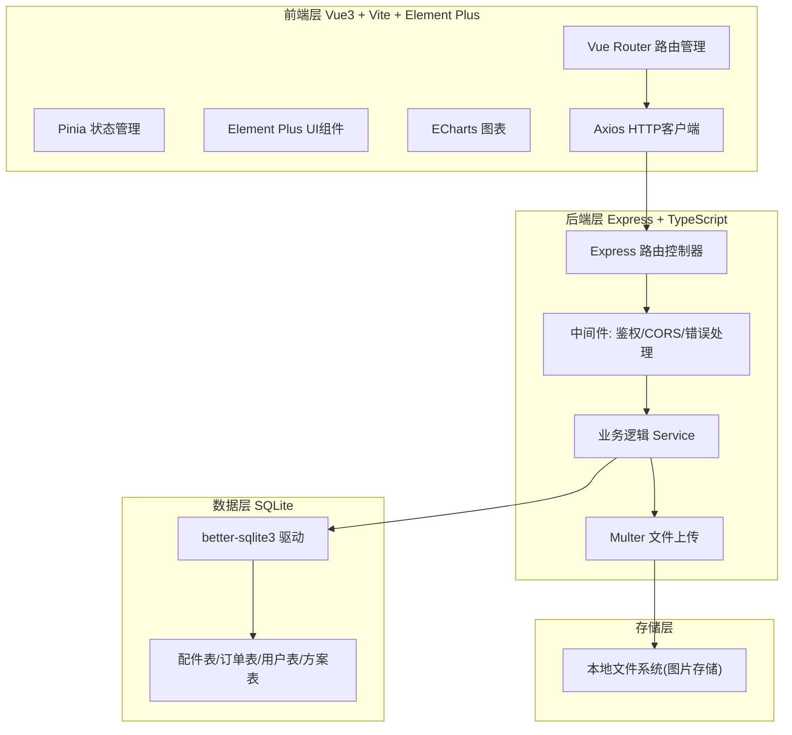
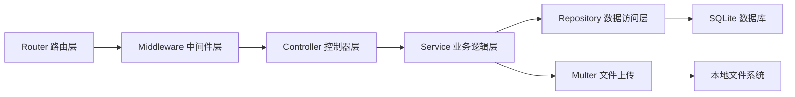
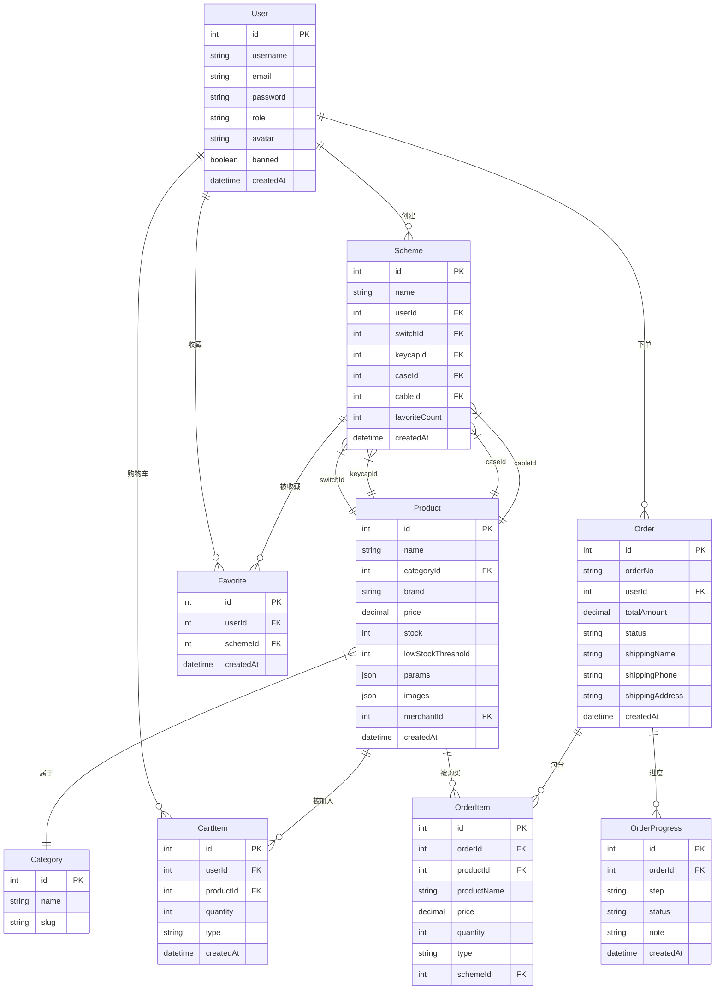

## 1. 架构设计



## 2. 技术说明

- 前端：Vue3@3 + Element Plus@2 + Vite@5 + TailwindCSS@3 + Pinia + Vue Router@4 + ECharts
- 初始化工具：vite-init (vue-express-ts 模板)
- 后端：Express@4 + TypeScript (ESM)
- 数据库：SQLite (better-sqlite3)
- 认证：JWT (jsonwebtoken)
- 文件上传：Multer
- 图表：ECharts@5

## 3. 路由定义

| 路由 | 用途 |
|------|------|
| / | 首页 |
| /products | 配件商城 |
| /products/:id | 配件详情 |
| /builder | 客制化组装器 |
| /cart | 购物车 |
| /checkout | 结算页 |
| /orders | 订单中心 |
| /orders/:id | 订单详情 |
| /favorites | 收藏夹 |
| /profile | 个人中心 |
| /login | 登录 |
| /register | 注册 |
| /merchant | 商家后台 |
| /merchant/products | 商家配件管理 |
| /merchant/orders | 商家订单管理 |
| /merchant/inventory | 商家库存管理 |
| /admin | 管理后台 |
| /admin/users | 用户管理 |
| /admin/statistics | 数据统计 |
| /admin/inventory | 库存监控 |

## 4. API 定义

### 4.1 认证接口
- POST /api/auth/register — 注册 { username, email, password, role? } → { token, user }
- POST /api/auth/login — 登录 { username, password } → { token, user }
- GET /api/auth/me — 获取当前用户 → { user }

### 4.2 配件接口
- GET /api/products — 配件列表 ?category=&brand=&minPrice=&maxPrice=&sort=&page=&limit=
- GET /api/products/:id — 配件详情
- POST /api/products — 创建配件 (商家) { name, category, brand, price, stock, params, images }
- PUT /api/products/:id — 更新配件
- DELETE /api/products/:id — 删除配件

### 4.3 购物车接口
- GET /api/cart — 获取购物车
- POST /api/cart/items — 添加商品 { productId, quantity, type: 'product'|'kit' }
- PUT /api/cart/items/:id — 更新数量 { quantity }
- DELETE /api/cart/items/:id — 删除商品
- DELETE /api/cart — 清空购物车

### 4.4 订单接口
- POST /api/orders — 创建订单 { items[], shippingInfo, customScheme? }
- GET /api/orders — 我的订单列表
- GET /api/orders/:id — 订单详情
- PUT /api/orders/:id/status — 更新订单状态 (商家) { status, progress? }
- POST /api/orders/:id/photos — 上传成品图 (商家)

### 4.5 客制化方案接口
- POST /api/schemes — 保存方案 { name, switchId, keycapId, caseId, cableId }
- GET /api/schemes — 我的方案列表
- GET /api/schemes/:id — 方案详情
- POST /api/schemes/:id/favorite — 收藏方案
- DELETE /api/schemes/:id/favorite — 取消收藏
- GET /api/schemes/popular — 热门方案

### 4.6 收藏接口
- GET /api/favorites — 我的收藏列表
- POST /api/favorites — 添加收藏 { schemeId }
- DELETE /api/favorites/:id — 取消收藏

### 4.7 统计接口 (管理员/商家)
- GET /api/stats/monthly-sales — 月度销量
- GET /api/stats/inventory-alert — 库存预警
- GET /api/stats/order-overview — 订单概览

### 4.8 用户管理接口 (管理员)
- GET /api/users — 用户列表
- PUT /api/users/:id/role — 修改角色 { role }
- PUT /api/users/:id/ban — 封禁/解封

### 4.9 文件上传接口
- POST /api/upload — 上传图片 (multipart/form-data) → { url }

## 5. 服务端架构图



## 6. 数据模型

### 6.1 数据模型定义



### 6.2 数据定义语言

```sql
CREATE TABLE categories (
  id INTEGER PRIMARY KEY AUTOINCREMENT,
  name TEXT NOT NULL,
  slug TEXT NOT NULL UNIQUE
);

CREATE TABLE users (
  id INTEGER PRIMARY KEY AUTOINCREMENT,
  username TEXT NOT NULL UNIQUE,
  email TEXT NOT NULL UNIQUE,
  password TEXT NOT NULL,
  role TEXT NOT NULL DEFAULT 'user' CHECK(role IN ('user','merchant','admin')),
  avatar TEXT DEFAULT '',
  banned INTEGER DEFAULT 0,
  createdAt TEXT DEFAULT (datetime('now'))
);

CREATE TABLE products (
  id INTEGER PRIMARY KEY AUTOINCREMENT,
  name TEXT NOT NULL,
  categoryId INTEGER NOT NULL REFERENCES categories(id),
  brand TEXT NOT NULL DEFAULT '',
  price REAL NOT NULL,
  stock INTEGER NOT NULL DEFAULT 0,
  lowStockThreshold INTEGER NOT NULL DEFAULT 10,
  params TEXT DEFAULT '{}',
  images TEXT DEFAULT '[]',
  merchantId INTEGER REFERENCES users(id),
  createdAt TEXT DEFAULT (datetime('now'))
);

CREATE TABLE cart_items (
  id INTEGER PRIMARY KEY AUTOINCREMENT,
  userId INTEGER NOT NULL REFERENCES users(id),
  productId INTEGER NOT NULL REFERENCES products(id),
  quantity INTEGER NOT NULL DEFAULT 1,
  type TEXT NOT NULL DEFAULT 'product',
  createdAt TEXT DEFAULT (datetime('now'))
);

CREATE TABLE schemes (
  id INTEGER PRIMARY KEY AUTOINCREMENT,
  name TEXT NOT NULL,
  userId INTEGER NOT NULL REFERENCES users(id),
  switchId INTEGER REFERENCES products(id),
  keycapId INTEGER REFERENCES products(id),
  caseId INTEGER REFERENCES products(id),
  cableId INTEGER REFERENCES products(id),
  favoriteCount INTEGER DEFAULT 0,
  createdAt TEXT DEFAULT (datetime('now'))
);

CREATE TABLE favorites (
  id INTEGER PRIMARY KEY AUTOINCREMENT,
  userId INTEGER NOT NULL REFERENCES users(id),
  schemeId INTEGER NOT NULL REFERENCES schemes(id),
  createdAt TEXT DEFAULT (datetime('now')),
  UNIQUE(userId, schemeId)
);

CREATE TABLE orders (
  id INTEGER PRIMARY KEY AUTOINCREMENT,
  orderNo TEXT NOT NULL UNIQUE,
  userId INTEGER NOT NULL REFERENCES users(id),
  totalAmount REAL NOT NULL,
  status TEXT NOT NULL DEFAULT 'pending' CHECK(status IN ('pending','confirmed','processing','completed','cancelled')),
  shippingName TEXT NOT NULL DEFAULT '',
  shippingPhone TEXT NOT NULL DEFAULT '',
  shippingAddress TEXT NOT NULL DEFAULT '',
  createdAt TEXT DEFAULT (datetime('now'))
);

CREATE TABLE order_items (
  id INTEGER PRIMARY KEY AUTOINCREMENT,
  orderId INTEGER NOT NULL REFERENCES orders(id),
  productId INTEGER REFERENCES products(id),
  productName TEXT NOT NULL,
  price REAL NOT NULL,
  quantity INTEGER NOT NULL DEFAULT 1,
  type TEXT NOT NULL DEFAULT 'product',
  schemeId INTEGER REFERENCES schemes(id)
);

CREATE TABLE order_progress (
  id INTEGER PRIMARY KEY AUTOINCREMENT,
  orderId INTEGER NOT NULL REFERENCES orders(id),
  step TEXT NOT NULL,
  status TEXT NOT NULL DEFAULT 'pending',
  note TEXT DEFAULT '',
  createdAt TEXT DEFAULT (datetime('now'))
);

-- 索引
CREATE INDEX idx_products_category ON products(categoryId);
CREATE INDEX idx_products_merchant ON products(merchantId);
CREATE INDEX idx_cart_items_user ON cart_items(userId);
CREATE INDEX idx_schemes_user ON schemes(userId);
CREATE INDEX idx_favorites_user ON favorites(userId);
CREATE INDEX idx_orders_user ON orders(userId);
CREATE INDEX idx_orders_status ON orders(status);
CREATE INDEX idx_order_items_order ON order_items(orderId);
CREATE INDEX idx_order_progress_order ON order_progress(orderId);

-- 初始分类数据
INSERT INTO categories (name, slug) VALUES ('轴体', 'switch');
INSERT INTO categories (name, slug) VALUES ('键帽', 'keycap');
INSERT INTO categories (name, slug) VALUES ('外壳', 'case');
INSERT INTO categories (name, slug) VALUES ('线材', 'cable');

-- 管理员账号 (密码: admin123, bcrypt加密)
INSERT INTO users (username, email, password, role) VALUES ('admin', 'admin@cybercraft.com', '$2b$10$placeholder_admin_hash', 'admin');
```
